# TEC Serverless Todo API – Deployment & Flow Preview

<p align="justify">
This document provides a complete and visually structured overview of the Serverless TODO API, implemented using AWS Lambda (Node.js + TypeScript), API Gateway (HTTP API), and DynamoDB. All sections are organized similarly to a UI preview, but adapted for AWS infrastructure, with screenshots referenced by filename.
</p>

## 1.DynamoDB Table

The application uses a DynamoDB table to store Todo items.

**Configuration**

- **Table Name**: `tec-practicantes-todo`
- **Partition Key**: `id` (String)
- **Capacity Mode**: On-Demand
- **Secondary Indexes**: Not required for this simple application.

**Screenshots**
<p>
In this section, we provide a series of screenshots that illustrate the step-by-step process of creating and configuring the DynamoDB used by the application.
</p>

<table>
    <tr>
       <td align="center" width="25%">
            <strong>DynamoDB Search</strong><br/>
            <p align="justify"><em>Initial AWS Console step where the user searches for the DynamoDB service. This marks the starting point of the infrastructure setup.</em></p><br/>
            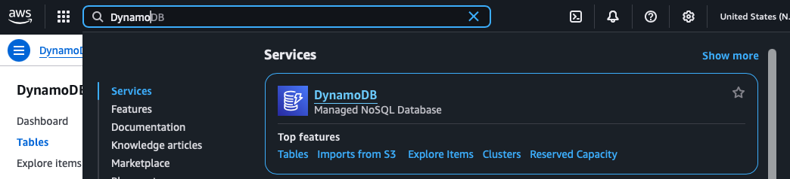
            </td>
            <td align="center" width="25%">
            <strong>Create Table Form</strong><br/>
            <p align="justify"><em>Form screen used to create the DynamoDB table. Here the table name, partition key, and billing mode are defined.</em></p><br/>
            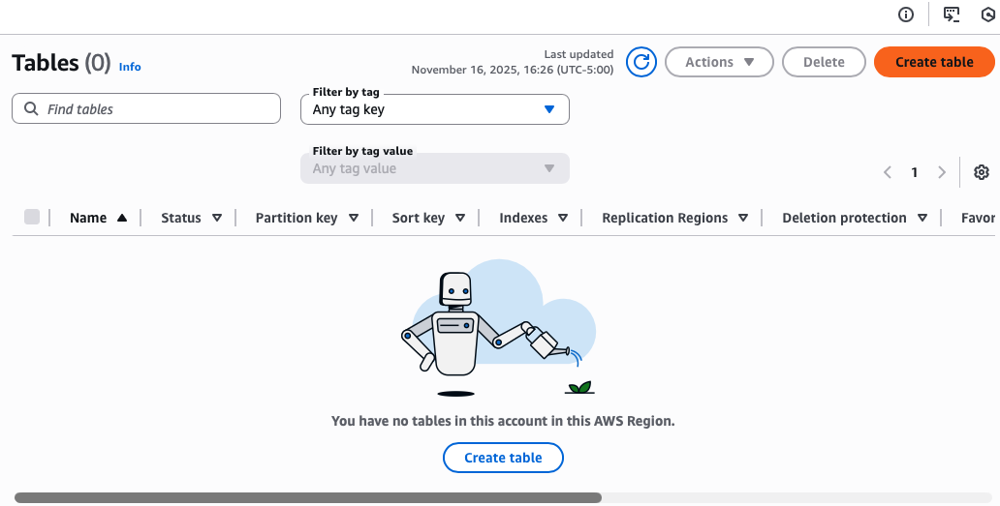
            </td>
            <td align="center" width="25%">
            <strong>Configuration Details</strong><br/>
            <p align="justify"><em>Detailed configuration for the new table, including partition key type, capacity mode, encryption, and additional settings.</em></p><br/>
            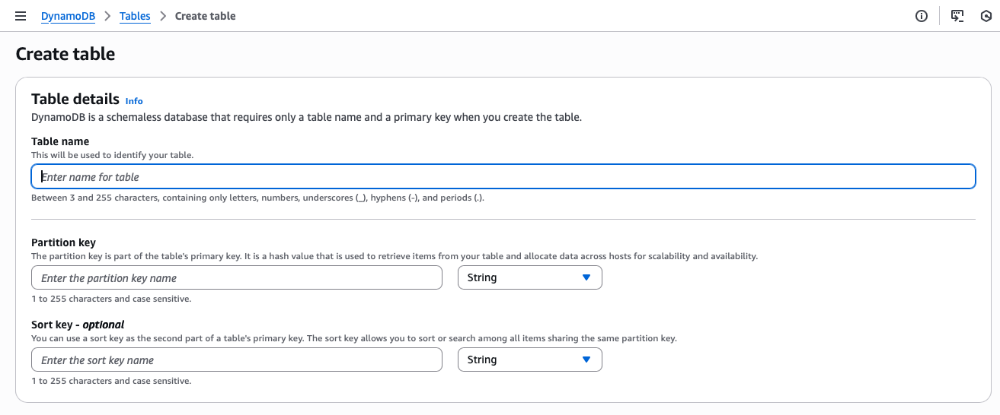
            </td>
            <td align="center" width="25%">
            <strong>Table Created</strong><br/>
            <p align="justify"><em>Final view confirming that the DynamoDB table has been successfully created and is now active.</em></p><br/>
            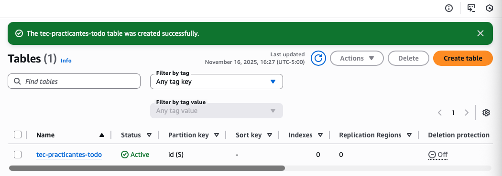
        </td>
    </tr>
</table>

## 2. Lambda Functions

<p align="justify">
The core logic is implemented inside an AWS Lambda function using TypeScript, clean architecture principles, and dependency injection.
</p>

**Features**

- **GET** `/todos`: Retrieve all Todo items.
- **POST** `/todos`: Create a new Todo item.
- Validation and error handling
- UUID generation with `randomUUID()`
- Error handling using `AppError` class.
- Full use of Domain, Application, and Infrastructure and Interface layers.

**Environment Variables**

- `TABLE_NAME`: Name of the DynamoDB table (`tec-practicantes-todo`)
- `AWS_REGION`: AWS region where the resources are deployed (e.g., `us-east-1`)

**Screenshots**

## 3. API Gateway

<p align="justify">
An <strong>API Gateway (HTTP API)</strong> exposes the Lambda function to the internet through clean REST-like routes.
</p>

**Routes**

- **GET** `/todos`: Invokes the Lambda function to retrieve all Todo items.
- **POST** `/todos`: Invokes the Lambda function to create a new Todo item.

**Integration**
Both routes are integrated with the same Lambda function, which handles the routing logic based on the HTTP method. (`tec-serverless-todo-api`)

**Invoke URL Example**

```
https://your-api-id.execute-api.your-region.amazonaws.com/todos
```

**Screenshots**
<p>
The following screenshots illustrate the deployment and configuration process of the Lambda function, including environment variables, IAM
permissions, and test events.
</p>

<table>
  <tr>
    <td align="center" width="25%">
      <strong>Lambda Search</strong><br/>
      <p align="justify"><em>Initial navigation step where the AWS Lambda service is searched within the AWS Console.</em></p><br/>
      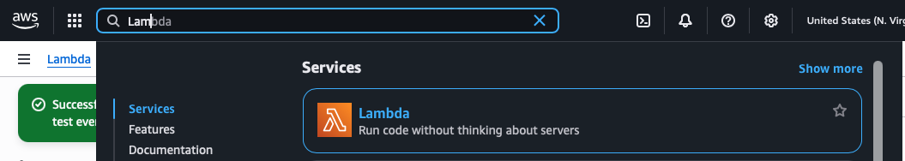
    </td>
    <td align="center" width="25%">
      <strong>Function Created</strong><br/>
      <p align="justify"><em>View showing the Lambda function successfully created with runtime, architecture, and basic configuration details.</em></p><br/>
      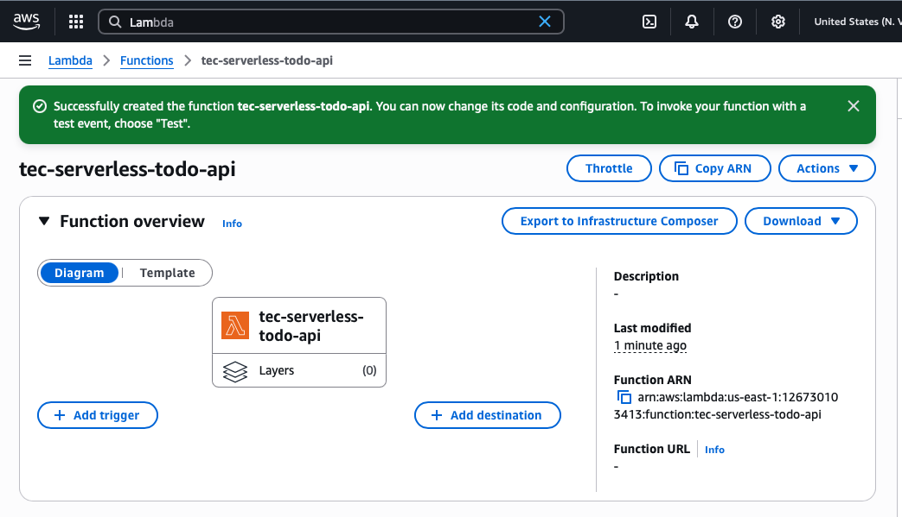
    </td>
    <td align="center" width="25%">
      <strong>Upload ZIP</strong><br/>
      <p align="justify"><em>Screen where the deployment package (ZIP) containing compiled TypeScript code is uploaded to Lambda.</em></p><br/>
      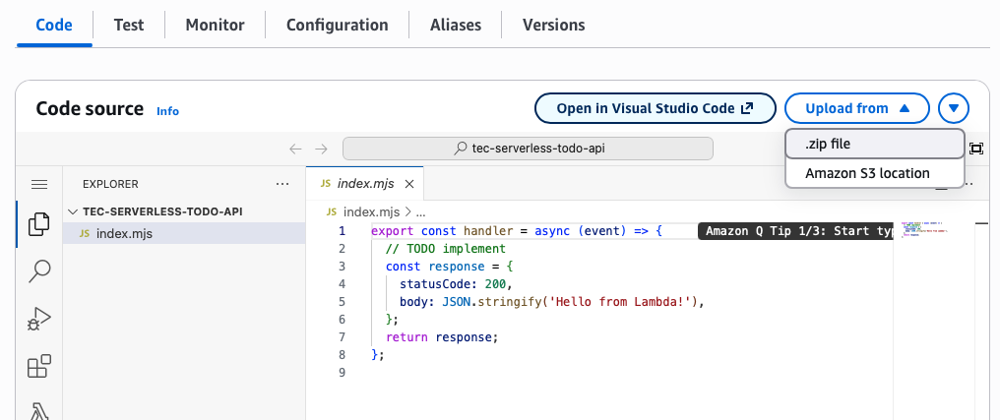
    </td>
    <td align="center" width="25%">
      <strong>Upload ZIP Modal</strong><br/>
      <p align="justify"><em>Dialog confirming the selected ZIP file before updating the Lambda code.</em></p><br/>
      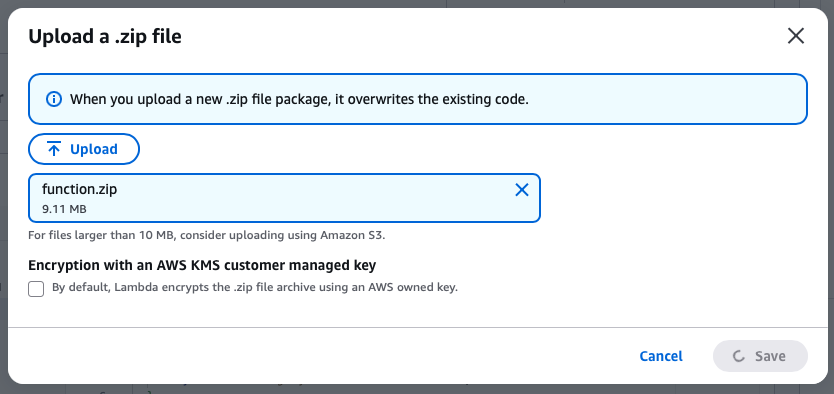
    </td>
  </tr>
  <tr>
    <td align="center">
      <strong>Environment Variables</strong><br/>
      <p align="justify"><em>Variables such as <code>TABLE_NAME</code> and <code>AWS_REGION</code> required for proper Lambda–DynamoDB integration.</em></p><br/>
      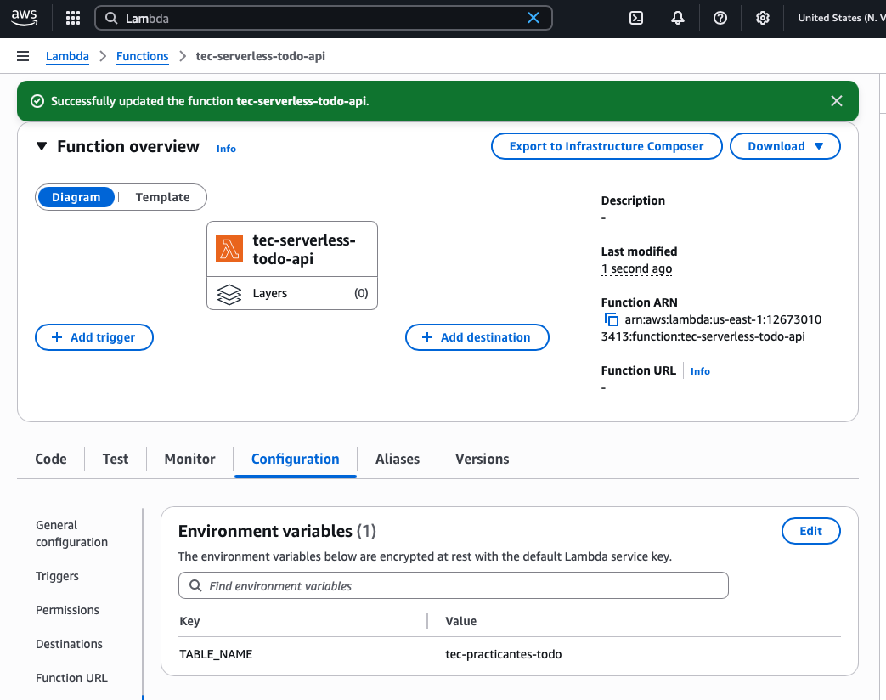
    </td>
    <td align="center">
      <strong>Code Editor</strong><br/>
      <p align="justify"><em>Internal Lambda code view used to inspect or debug the deployed handler file.</em></p><br/>
      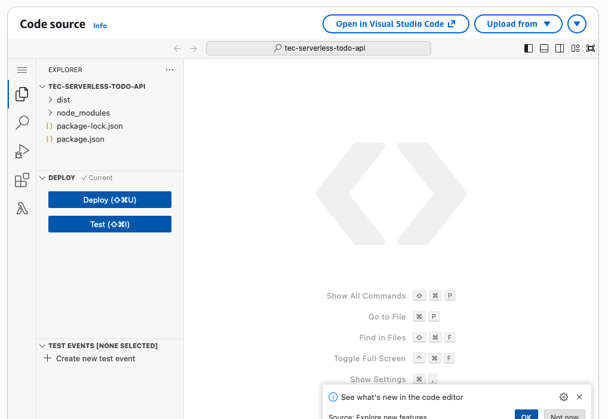
    </td>
    <td align="center">
      <strong>GET Event Created</strong><br/>
      <p align="justify"><em>Confirmation of the GET event stored for repeated Lambda invocations.</em></p><br/>
      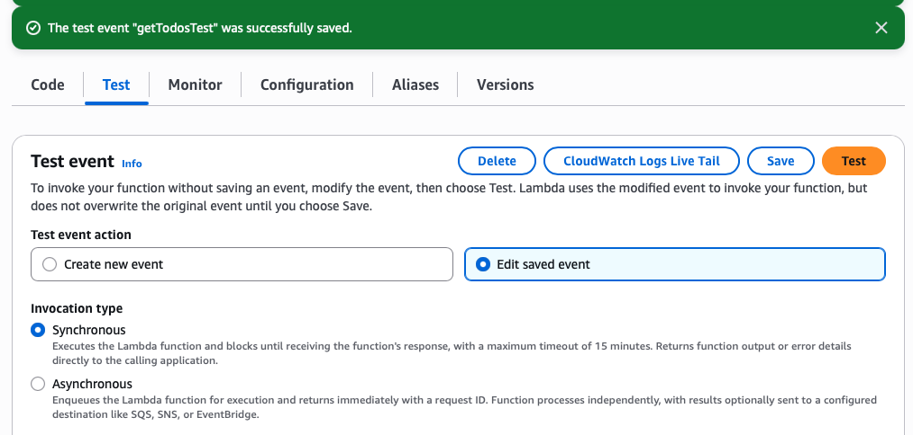
    </td>
    <td align="center">
      <strong>IAM Role Permissions</strong><br/>
      <p align="justify"><em>IAM role associated with the function, displaying DynamoDB read/write permissions for secure access.</em></p><br/>
      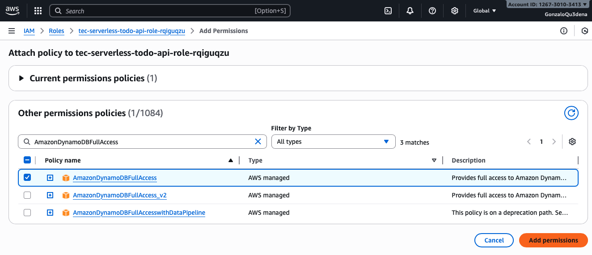
    </td>
  </tr>
  <tr>
    <td align="center">
      <strong>Policy Applied</strong><br/>
      <p align="justify"><em>View confirming the policy attached to the Lambda execution role granting DynamoDB privileges.</em></p><br/>
      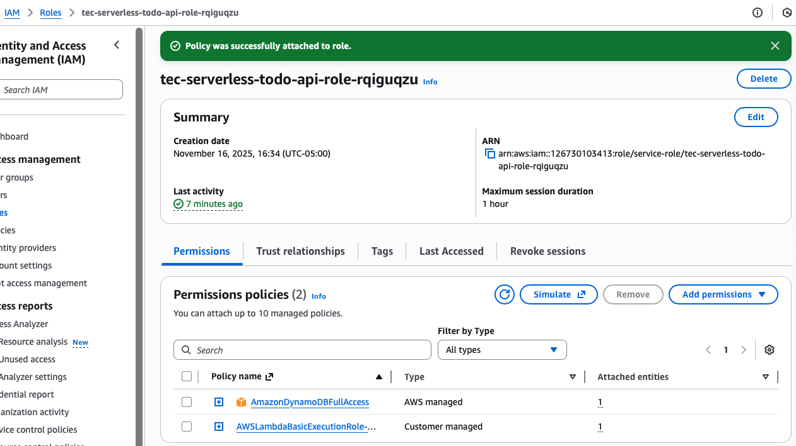
    </td>
    <td align="center">
      <strong>GET Success Response</strong><br/>
      <p align="justify"><em>Execution result showing a successful <code>GET /todos</code> operation with items retrieved from DynamoDB.</em></p><br/>
      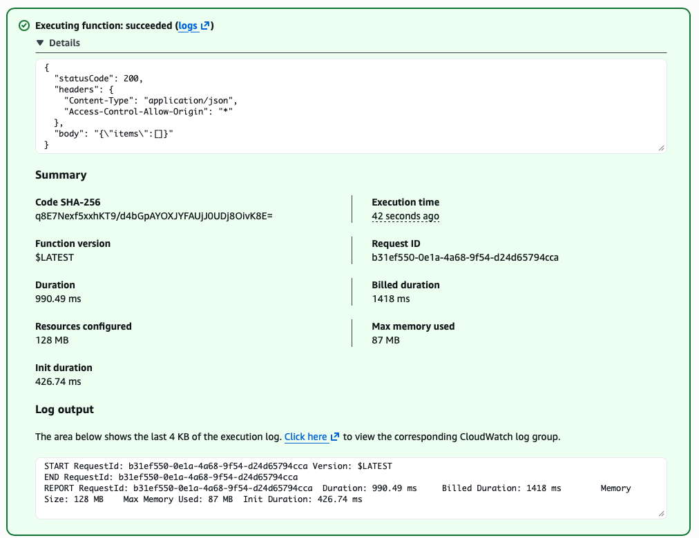
    </td>
    <td align="center">
      <strong>POST Success Response</strong><br/>
      <p align="justify"><em>Execution result showing a successful <code>POST /todos</code> creation of a new Todo item.</em></p><br/>
      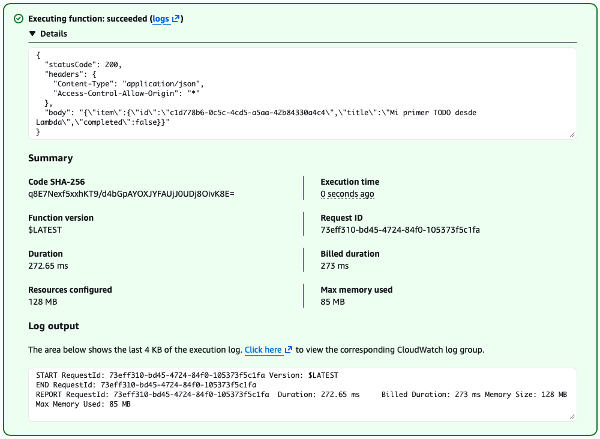
    </td>
  </tr>
</table>

## 4. End-to-End Flow (Postman)

### GET /todos

**Request**

```
GET https://your-api-id.execute-api.your-region.amazonaws.com/todos
```

**Response**

```json
200 OK
{
    "items": [
        {
            "id": "913b39a0-b4e2-4c9a-8f52-e063a1d8e499",
            "title": "Something from API Gateway",
            "completed": false
        }
    ]
}
```

### POST /todos

**Request**

```
POST https://your-api-id.execute-api.your-region.amazonaws.com/todos
Content-Type: application/json
{
    "title": "Sample Todo"
}
```

**Response**

```json
200 OK
{
  "item": {
    "id": "uuid-generated",
    "title": "Mi primer TODO desde API Gateway",
    "completed": false
  }
}
```

**Screenshots**
<p>
The following screenshots illustrate the end-to-end testing of the API using Postman, showcasing both GET and POST requests along with their respective responses.
</p>

<table>
  <tr>
    <td align="center" width="25%">
      <strong>API Gateway Search</strong><br/>
      <p align="justify"><em>Initial navigation step where the user searches for API Gateway in the AWS Console.</em></p><br/>
      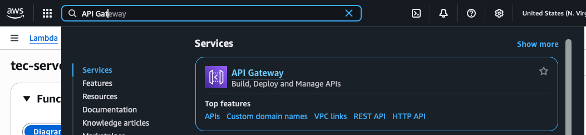
    </td>
    <td align="center" width="25%">
      <strong>Create HTTP API</strong><br/>
      <p align="justify"><em>Screen where the user selects the option to create an HTTP API, used to expose the Lambda function.</em></p><br/>
      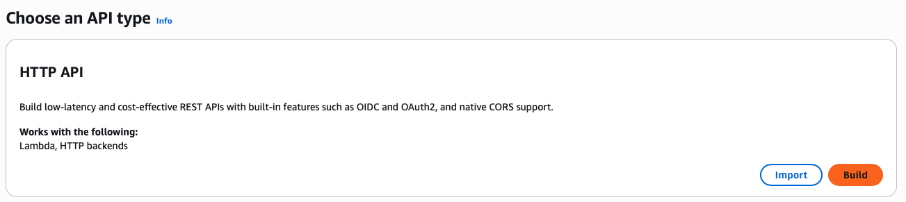
    </td>
    <td align="center" width="25%">
      <strong>Configure Routes</strong><br/>
      <p align="justify"><em>Definition of routes such as <code>GET /todos</code> and <code>POST /todos</code>, each mapped to the same Lambda function.</em></p><br/>
      
    </td>
    <td align="center" width="25%">
      <strong>Review and Create</strong><br/>
      <p align="justify"><em>Final review screen summarizing routing, integrations, and endpoint creation before deployment.</em></p><br/>
      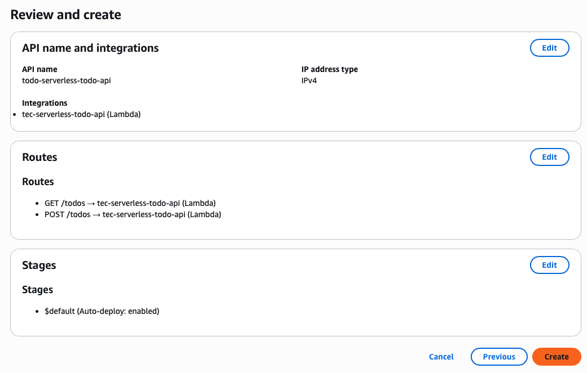
    </td>
  </tr>
  <tr>
    <td align="center">
      <strong>Route Details</strong><br/>
      <p align="justify"><em>Detailed view of the created API routes, showing methods and paths configured for the Todo API.</em></p><br/>
      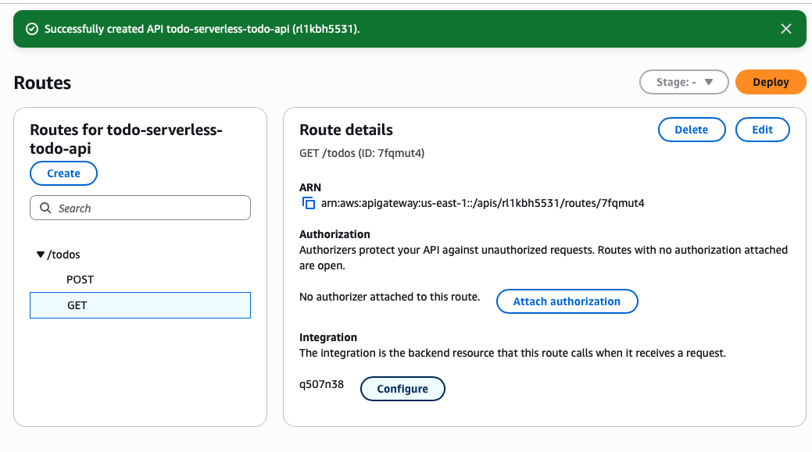
    </td>
    <td align="center">
      <strong>Lambda Integration</strong><br/>
      <p align="justify"><em>Integration screen showing how each route maps to the Lambda function, including version and invocation settings.</em></p><br/>
      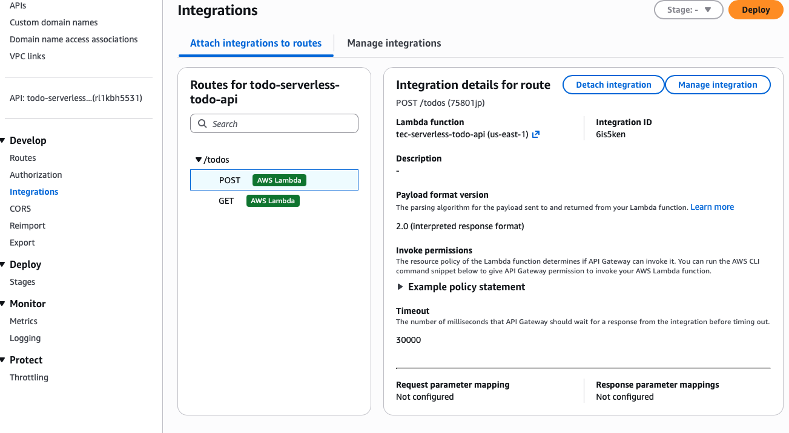
    </td>
    <td align="center">
      <strong>POST Success</strong><br/>
      <p align="justify"><em>Successful test of the <code>POST /todos</code> route, confirming proper invocation of the Lambda function.</em></p><br/>
      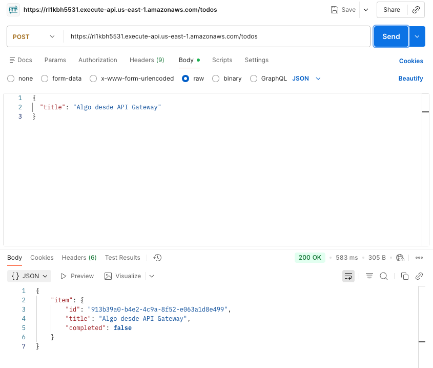
    </td>
    <td align="center">
      <strong>GET Success</strong><br/>
      <p align="justify"><em>Successful test of the <code>GET /todos</code> route, verifying correct retrieval of DynamoDB items.</em></p><br/>
      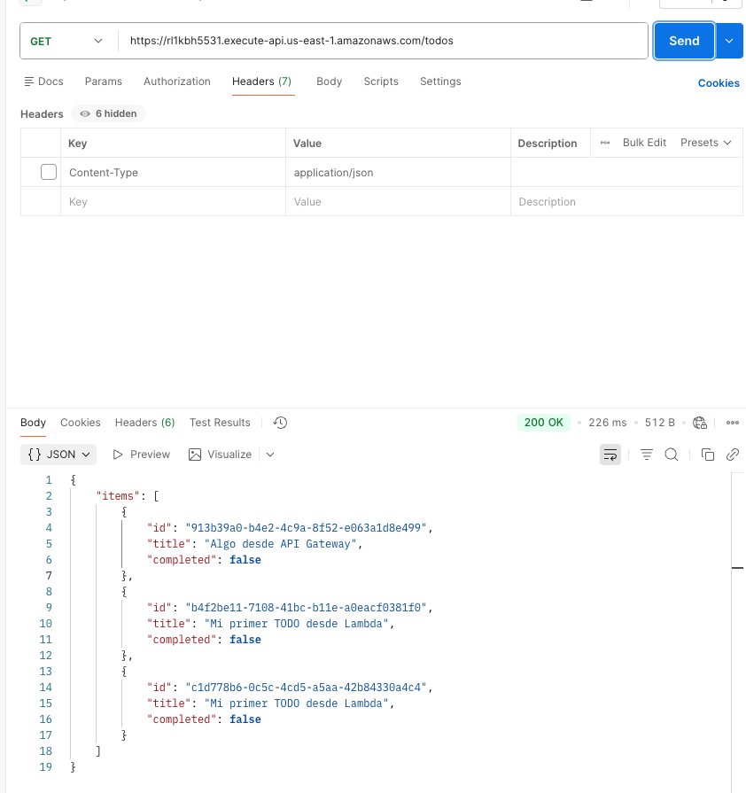
    </td>
  </tr>
</table>


## 5. Screenshot Folder Structure

<p align="justify">
The following is the folder structure where all referenced screenshots are stored for easy access and organization.
</p>

```
docs/
└── screenshots/
    ├── apigateway-configure-routes.png
    ├── apigateway-create-http-api.png
    ├── apigateway-integration-settings.png
    ├── apigateway-review-and-create.png
    ├── apigateway-routes-details.png
    ├── apigateway-search-service.png
    ├── apigateway-test-get-success.png
    ├── apigateway-test-post-success.png
    ├── dynamodb-create-table-form.png
    ├── dynamodb-search-table.png
    ├── dynamodb-table-config-details.png
    ├── dynamodb-table-created.png
    ├── lambda-code-editor-view.png
    ├── lambda-env-variables.png
    ├── lambda-function-created.png
    ├── lambda-iam-role-dynamodb-permissions.png
    ├── lambda-policy-applied.png
    ├── lambda-search-service.png
    ├── lambda-test-event-get-created.png
    ├── lambda-test-event-get-success.png
    ├── lambda-test-event-get.png
    ├── lambda-test-event-post-success.png
    ├── lambda-upload-zip-button.png
    ├── lambda-upload-zip-modal.png
    └── SERVERLESS_API_PREVIEW.txt
```
